# KeepKey Vault

  
  <h1>KeepKey Vault</h1>
  
An open-source interface for the KeepKey hardware wallet built on the Pioneer SDK

## Overview

KeepKey Vault is a modern, secure, and user-friendly interface for managing your KeepKey hardware wallet. Built with Next.js and powered by the Pioneer SDK, it provides a seamless experience for managing your digital assets while maintaining the highest security standards.

  

## Features

- 🔒 **Secure**: Direct integration with your KeepKey hardware wallet
- 🌐 **Multi-Chain Support**: Manage assets across multiple blockchains
- 💼 **Portfolio Management**: Track and manage your digital assets in one place
- 🔄 **Real-Time Updates**: Live price updates and portfolio tracking
- 🎨 **Modern UI**: Clean, intuitive interface with dark mode support
- 🛠 **Open Source**: Transparent, community-driven development

## Getting Started

### Prerequisites

- Node.js 16.x or later
- A KeepKey hardware wallet
- Yarn or npm package manager

### Installation

1. Clone the repository:
\`\`\`bash
git clone https://github.com/yourusername/keepkey-vault.git
cd keepkey-vault
\`\`\`

2. Install dependencies:
\`\`\`bash
yarn install
# or
npm install
\`\`\`

3. Set up environment variables:
\`\`\`bash
cp .env.example .env.local
\`\`\`

4. Start the development server:
\`\`\`bash
yarn dev
# or
npm run dev
\`\`\`

## Usage

  
  
Connect your KeepKey device and get started

1. Connect your KeepKey device to your computer
2. Launch KeepKey Vault
3. Follow the on-screen instructions to initialize or restore your wallet
4. Start managing your digital assets!

## Security

  

- All sensitive operations require physical confirmation on your KeepKey device
- Your private keys never leave your KeepKey hardware wallet
- Open-source code allows for community security audits
- Built on the battle-tested Pioneer SDK

## Development

### Architecture

The application is built with:
- Next.js 13+ (App Router)
- TypeScript
- Chakra UI
- Pioneer SDK
- @coinmasters/pioneer-react

### Environment Variables

Required environment variables:
\`\`\`
NEXT_PUBLIC_PIONEER_URL=http://127.0.0.1:9001/spec/swagger.json
NEXT_PUBLIC_PIONEER_WSS=ws://127.0.0.1:9001
\`\`\`

## Contributing

We welcome contributions! Please feel free to submit a Pull Request.

## License

This project is licensed under the MIT License - see the [LICENSE](LICENSE) file for details.

## Support

If you need help or have questions:
- Open an issue on GitHub
- Join our community Discord
- Visit our [support portal](https://keepkey.com/support)

---

  Made with ❤️ by the KeepKey community

